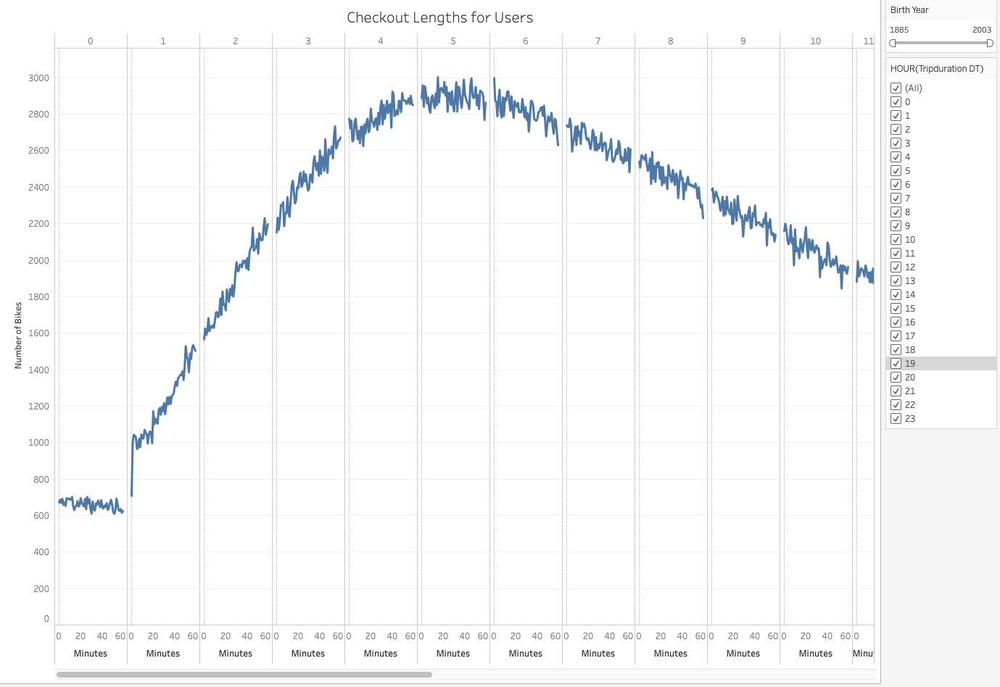
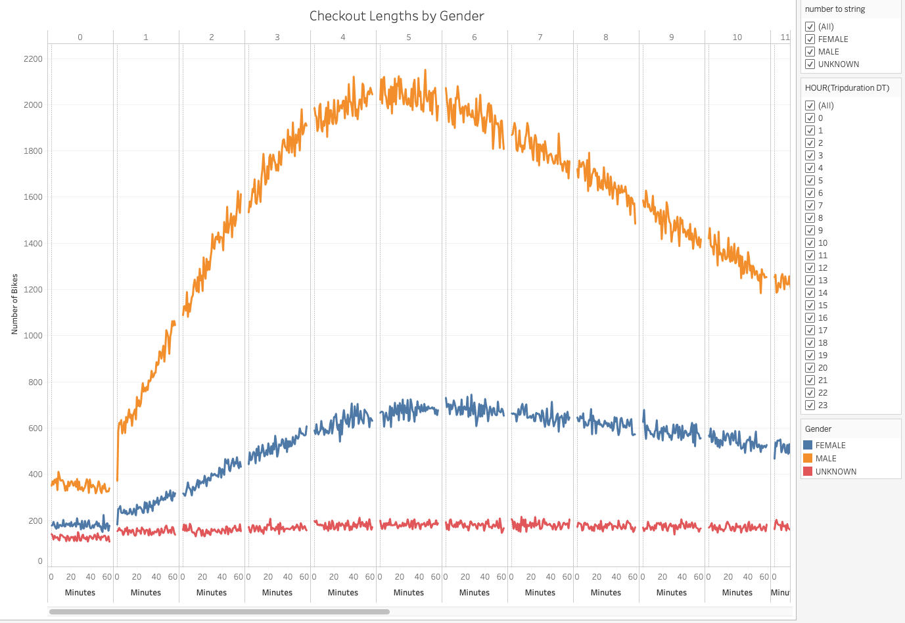
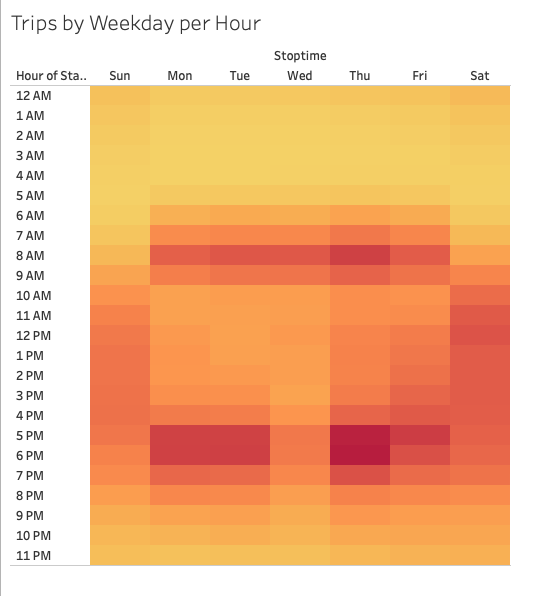
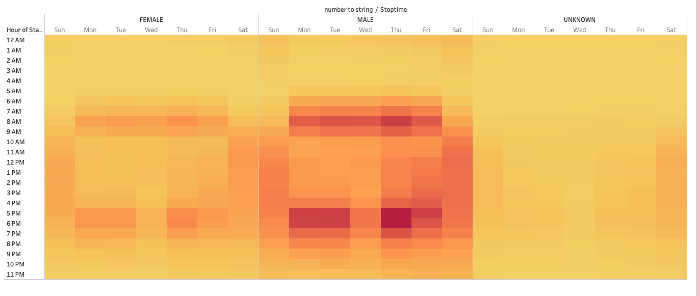
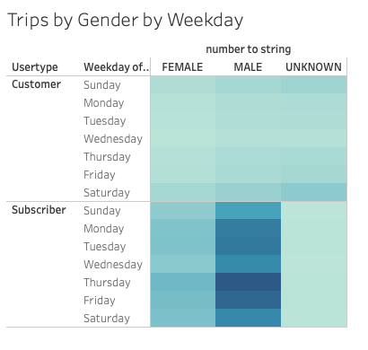
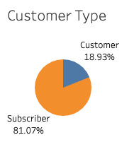
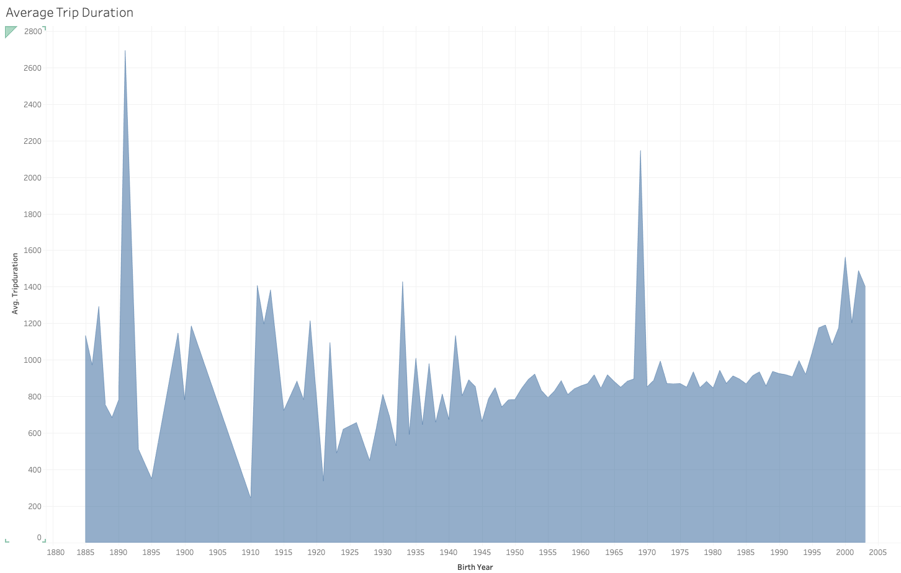

# tableau_citibike

*****
*****

* By: Tyler Sojka
* December 2020
* JavaScript: Using JavaScript to create a web dashboard with plotly, jQuery, HTML, D3.js
  
*****
*****

## Tools

* Tableau
  * Tableau is a data visualization software that is used for data science and business intelligence. Tableau can create a wide range of different visualization to interactively present the data and showcase insights. It comes with tools that allow to drill down data and see the impact in a visual format that can be easily understood by any individual. Tableau also comes with real-time data analytics capabilities and cloud support
    * Tableau worksheets
      * Worksheets are the building blocks of our visualizations from which we are able to create dashboards and stories. A worksheet is made up of a single graph or plot
    * Tableau dashboards
      * dashboards are a collection of worksheets formatted to present data in a way that is easy to read.
    * Tableau stories
      * Tableau stories are simply Tableau dashboards that include narration of what is occuring with the data.

*****
*****

## Overview

The purpose of this analysis is to learn the basics of tableau, and help Kate explore the possibility of starting a bike share company, like Citi Bike, in Des Moines, Iowa. After taking a trip to New York City and loving the experience of exploring the city using the bike sharing platform, Citi Bike, Kate wants to know if it might be a good idea to bring the idea to Des Moines.

Using data recorded by Citi Bike for one of the busiest months of 2019, we analyzed key aspects of the popularity of Citi Bike. We looked at key demographics of the users of Citi Bike as well as potential large expenditures and information about the rides, and locations.

## Results

Welcome to the most terrible module yet, where the graphs are wrong and nothing matters. Throughout this result section, I will be taking you on a journey of outright wrong data. In this module we were FORCED to create plots using the wrong conversions. Why you might ask? Well the answer to that is simple, this bootcamp is hot garbage.

The garbage starts out with us converting our trip duration column to datetime. Easy peasy? Not so much. The module forces us to convert the data using minutes as the conversion to match their graphs, which are wrong. The column in question is measured in seconds, which in turn, makes every graph using this data wrong. Here is the first one:

As you can see in this wonderful plot, the majority of the rides last, wait for it, 4-6 hours. To any aspiring data scientist this should seem a little suspect. How could a bike sharing service average lengths that long? Well they can't. That should 4-6 minutes. You would think that whoever built this material would catch a simple mistake like that before pushing it out to hundreds of students across the company. You would also think that some of those students and staff would catch a mistake like this. You would think that once a mistake like this was caught they would simply fix it in the course material. You would think that a program designed to teach students data analysis would get this right. If you thought that, you were wrong. Anyways this is a graph showing the amount rides and their lengths. It shows you that the most rides lasted 5 hours (minutes, ffs this is stupid).

The next gem we have to show off on our professional portfolios is the exact same as the last, except separated by genders:

This bad boi, insert slapping a bag of spaghetti sound, shows you that males use the platform the most, followed by females then unknown, all with a similar ride length curve peaking around 5 hours (minutes, I can't believe I'm paying 12k for this material).

Next up on our trip around this dumpster fire is:

This graph illustrates, beautifully if I might add, when the peak times of the day, each day are. The darker the color represents more rides starting at that time. As you can see here it seems to focus around the start(7-9 AM) and end of work days(4-6 PM). Then in the afternoon and early evening on weekends. This makes sense.

Up next we have:

This delicious plot is wonderfully wide so you can't even view the whole thing on a normal size dashboard! Gotta love that for clean looking visuals! This one shows the viewer what they should already know: checkout times by date are the highest by males, then by females and finally unknown. Once you know males are the largest user base, and then see the checkout time distribution from the last graph, its pretty likely the trend is going to continue. Also why we didn't just add a filter to be able to view these one at a time instead of side-by-side is a mystery. Anywhoozle, Males tend to use the bikes more than females and unknown in the same pattern discussed on the last graph.

Finally for the oh so required plots we have:

If you've been following along, you'll notice that males dominate the trips when broken down to usertypes. As you can see here, and could have probably guessed, males make up most of subscriber rides for every day of the week. This also gives you a terrible glimpse at the over all customer type which would be a more useful graphic. hint: the majority is subscribers.

Now onto the REQUIRED MODULE PLOTS! Up first we have this little bitty:

Who doesn't love a pie chart? Im pretty sure pie charts are one of the worst ways to represent almost any kind of data. I literally had to force myself to go against the wishes of this fantastically taught module and add some text and numbers to this one so don't dock me points for making it better. Originally its just an orange and blue pie chart with zero reference to what the segments equate to. God awful chart. As you can see here over 80% of the riders are subscribers.

FINALLY the last delicious plot.

This puppy right here shows you the average trip durations (actually in seconds, thank god. Not that this module addressed that fact which seems pretty important because they want us to turn in a graph with unlabeled units) and that in general, the later the birth year, the longer the ride duration.

## Summary

The biggest datapoint not mentioned in the data is the city itself. NYC and Des Moines are in completely different categories. NYC boasts a hearty population of over 8.3 million people, almost 12x that of Des Moines’ 700,000. NYC also has one of the largest tourism populations in the world, with 65.2 million visitors in 2018, including 13.5 international arrivals. Des Moines on the other hand, 13.7 million.

Plus the data indicates that people are using the bikes to get to and from work. The average commute in nyc is 35 minutes.  In Des Moines it’s 19 minutes. Also the weather is colder on average so likely less customers in the winter.

Also this seems like a pretty dumb way to do this. It's like looking at all the metrics of Apple, and trying to pitch why making another Apple is a good idea.

So basically don't invest in this terrible idea. If this is all you have to go on, just get out while you can. Yeah, Citi Bike boasts over 2 million rides in August 2018, but that NYC. Knowing that males use the platform the most is, I guess a useful bit of data, but showing an investor that same data 3 different ways is redundant. Also high-level summary from this top notch analysis? Subscribers make up most of the users, males make up most of the users, and the platform is used the most to get to and from work, as well as on the weekends. So there ya go. I hope you're happy you guys made me do this.

Two additional, potentially more beneficial visualizations would be an investigation into the crazy spike of users born in 1969. It would be interesting to see what percentage of the total riders these are, and how they are using the platform. There, 2 more suggested visualizations. I already did them too:

People who were born in 1969 make up just over 10% of all the rides taken. This is pretty crazy. Why so many born in 1969? Who knows.

Looking at the gender distribution of those people born in 1969, the majority were unknown gender, so it seems maybe that is a default year when signing up?

Looking a little closer to the types of riders born in 1969, it seems that the majority of them are customers, or one time users. This analysis leads me to believe that when customers, or one time users, use the platform, they are defaulted to being born in 1969, and unknown gender unless they choose to change it.
